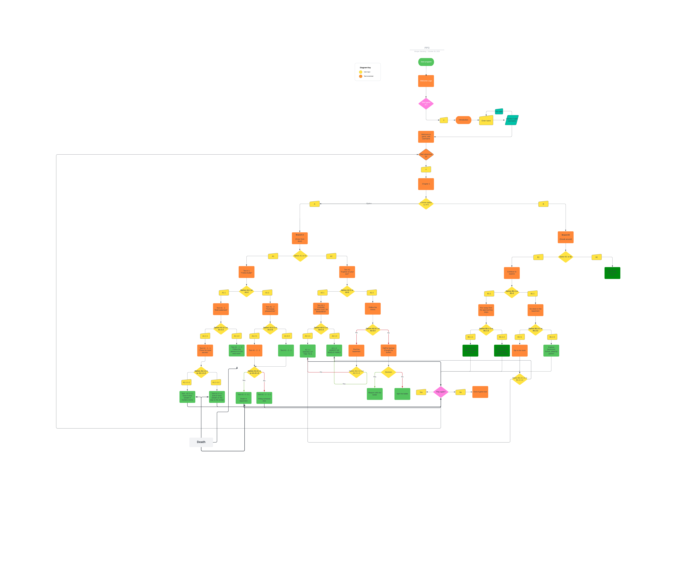
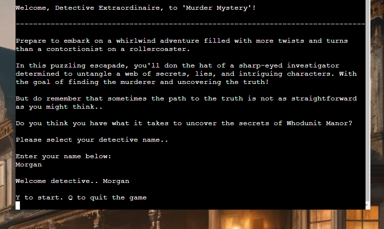
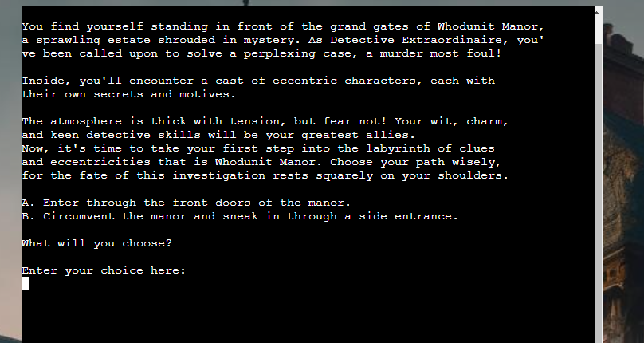
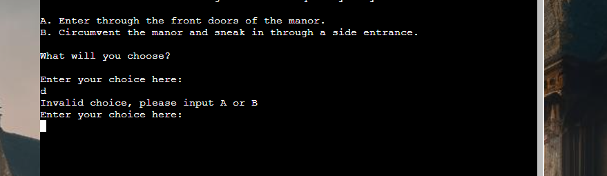
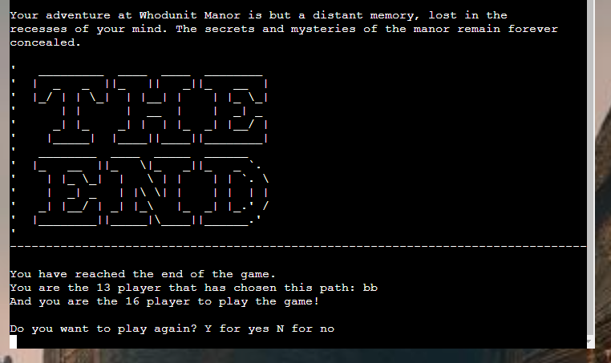
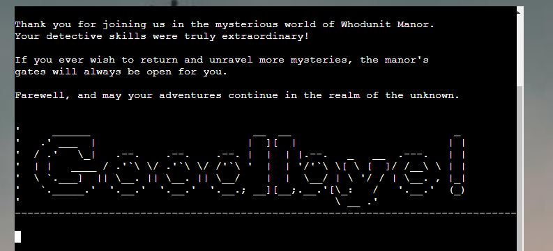

# Murder Mystery
Murder mystery is a text based adventure game, meant to take the user on a fun and somewhat surrealistic journey through the world that is Whodunit manor. 

You play the game as a detective arriving to solve a mysterious murder and your success depends on the choices you make. At the end of the game you are presented with facts around your chosen path in the game, to see if you are the first to take it or if others have tried it before! 

## Table of contents
- [User stories](#user-stories)
- [Strategy](#strategy)
- [Flowchart](#flowchart)
- [Features](#features)
- [Technologies](#technologies)
- [Testing](#testing)
- [Bugs](#bugs)
- [Deployment](#deployment)
- [Credits](#credits)

## Demo
Link to live site: https://murder-mystery-text-game-fb1e2ed36c7e.herokuapp.com/
- Insert screenshot here:

## User stories
This application is created for anybody that enjoys a good mystery and some weird twists along the way.

- For fans of text-based adventure games, where each decision can take you down a different path.
- For fans of "Whodunit"/detective movies and games, where the plot thickens the deeper you get.

## Strategy
The strategy for developing this game was to make a fun, engaging and simple game. Where the correct choice is not always obvious for the user. With a focus on the narrative story itself, and that different parts are revealed with the different paths taken in the game. So that the user can play the game multiple times and have different experiences. 

It is also designed to be user friendly, with a simple choice-based system that takes the user through the game. 

## Flowchart
I used a flowchart to map out the different branches of the story. With some minor changes during the build process. It was very helpful in keeping track of the different endings for the different story branches. 

## Features

### How to play 
It is very easy to play the game, you simply enter the requested input, "Y to start, Q to quit" or "A" or "B" for the different choices during the game. 

### Welcome screen
Here the user is welcomed to the game and is prompted to enter their username/detective's name. 

Then the user can choose between Y to start the game and Q to quit the game. 

### Player choice
Once the game is started the player is presented with a choice, which will take them down different branches of the story. 

### Wrong input
If the user enters an invalid input, they are presented with a text acknowledging that and they are prompted to enter a valid input

### End of game
When the user has reached the end of the story branch that they have traversed, they are presented with a text concluding the game and ASCII art adding "The End". They can now choose between playing again or ending the game. If they choose to play again they are taken back to the first choice of the game. 
They are also presented with some information about their chosen path in the game, how many that have chosen that exact path before them and how many that have played the game in total. This information is taken from a google sheet that stores the paths of all the users and then compares that to the current path taken by the user. 

### Goodbye screen
This is presented when the user has either chosen to not start the game in the beginning or when they choose to not restart the game after reaching the end. 

### Future features
- An effect that prints the text slowly for the user, as to make it feel like the story is written out for the user.

## Technologies

### Coding languages
- **Python**, used for the application
- **HTML** and **CSS** for styling

### Libraries and packages
- **OS** and **Platform** for the clear_screen function
- **Sys** for exiting the game.
- **Time**, to delay printing of text to terminal
- **Gspread**, to use with connecting google sheet

### Other tools
- **LucidCharts,** to create the flowchart.
- **GitHub,** to host the application source code.
- **Gitpod,** to create/edit the source code.
- **Heroku,** to host the application.

## Testing

### Validating
The code has been put through [CI Python Linter](https://pep8ci.herokuapp.com/#). The only errors that show up are related to the ASCII art that is used, as well as errors for visual indentation of long lines. 

### Manual testing
The game has been tested throughout the build process by running it directly in the console, this in combination with adding in print statements to see how the code progresses has helped a lot in debugging and solving problems with the code. 

- All the different story branches have been tested, each working as intended. 
- Restaring game after reaching end of game. 
- Quitting the game after reaching end of game, as well as chosing to not start the game. One bug found regarding quitting the game, se details below.
- Handling invalid input. 
- Validating username.
- Storing and retrieving data from google sheet works as intended. 

## Bugs

- Not clearing the terminal completely once deployed. The function clear_screen is not clearing all of the content that is in the terminal when running the game deployed on Heroku. It is only clearing what content is visible in the terminal, so some text will be left that belongs to previous branches. 

### Solved bugs
- If the user has played several times and then chooses to quit the game, the goodbye text is shown but it also asks for input. This does not appear when quitting the game directly or after just one "round". This was solved by refactoring user choice function and main function, to avoid recursive code. This was done with the help of my mentor Sandeep. 

### Problems encountered during build process

- Refactoring the main logic for the game, the function that handles the user choices, and problems related to the refactoring.

I started building the game with different functions for each level that the player traversed through the game, but I realized that this became quite unwieldy and would have been tiresome to work with. So I made one function to handle every choice made by the user.

It took a long time to get this function to work, and I had trouble with everything from handling invalid input to what kind of method I should use to access the functions with the different branches of the story. I especially had trouble with how to handle ending the game when the user reached the end of a story branch and how to handle branches of the story that were shorter than others, since I didn't want every branch to be the same length. 

This was eventually solved with alot of trying and failing, reading through Stackoverflow and other sites (links are in credits) and most importantly discussing it with my mentor. 

## Deployment

The project was deployed to [Heroku](https://www.heroku.com) using the below procedure:    
  
- **Log in to Heroku** or create an account if required.
- **click** the button labeled **New** from the dashboard in the top right corner, just below the header.
- From the drop-down menu **select "Create new app"**.
- **Enter a unique app name**. I used the name for the game and added "text-game" to it. 
- Once the web portal shows the green tick to confirm the name is original **select the relevant region.** In my case, I chose Europe as I am in Sweden.
- When happy with your choice of name and that the correct region is selected, **click** on the **"Create app" button**.
- This will bring you to the project "Deploy" tab. From here, navigate to the **settings tab** and scroll down to the **"Config Vars" section**. 
- **Click** the button labeled **"Reveal Config Vars"** and create config vars for CREDS and PORT.
- Scroll down to the **buildpacks section of the settings page** and click the button labeled **" add buildpack," select "Python," and click "Save Changes"**.
- **Repeat but** this time **add "node.js" instead of python**. 
   -  ***IMPORTANT*** The buildpacks must be in the correct order.
- Scroll back to the top of the settings page, and **navigate to the "Deploy" tab.**
- From the deploy tab **select Github as the deployment method**.
- **Confirm** you want to **connect to GitHub**.
- **Search** for the **repository name** and **click** the **connect** button next to the intended repository.
- From the bottom of the deploy page **select your preferred deployment type** by follow one of the below steps:  
   - Clicking either "Enable Automatic Deploys" for automatic deployment when you push updates to Github.  
   - Select the correct branch for deployment from the drop-down menu and click the "Deploy Branch" button for manual deployment. 

## Credits

- To my mentor Sandeep Aggarwal who was very helpful overall with this project and especially regarding the refactoring of the main logic for the game. 

- How to get username and check if valid. [Code Institute LMS LS101 - Love Sandwiches walkthrough project](https://learn.codeinstitute.net/courses/course-v1:CodeInstitute+LS101+2021_T1/courseware/293ee9d8ff3542d3b877137ed81b9a5b/c92755338ef548f28cc31a7c3d5bfb46/?child=last)
- Clearing terminal in python [Stackoverflow](https://stackoverflow.com/questions/2084508/clear-terminal-in-python)
- Accessing Python dictionaries [W3 School](https://www.w3schools.com/python/python_dictionaries_access.asp)
- Using lower() function [Stackoverflow](https://stackoverflow.com/questions/28406568/need-python-to-accept-upper-and-lower-case-input)
- Delaying printing to terminal [Reddit](https://www.reddit.com/r/learnpython/comments/16avx3o/is_there_a_way_to_slow_down_text_in_a_console_app)
- Using in and not in operators [Askpython](https://www.askpython.com/python/examples/in-and-not-in-operators-in-python)
- Using startswith [W3 School](https://www.w3schools.com/python/ref_string_startswith.asp)
- Calling a function depending on user input [Stackoverflow](https://stackoverflow.com/questions/52562941/how-to-call-a-function-depending-on-the-user-input)
- How to store input and call it later [Stackoverflow](https://stackoverflow.com/questions/50670774/how-to-store-user-input-in-python-and-call-it-later)
- Storing function in a list or dictionary and calling it[Stackoverflow](https://stackoverflow.com/questions/9205081/is-there-a-way-to-store-a-function-in-a-list-or-dictionary-so-that-when-the-inde)
- Using a dictionary to call function based on user input[Stackoverflow](https://stackoverflow.com/questions/59169733/python-how-to-use-a-dictionary-to-call-methods-values-in-dictionary-to-run-ba)
- Checking if a key exists in a dictionary[Stackoverflow](https://stackoverflow.com/questions/1602934/check-if-a-given-key-already-exists-in-a-dictionary)
- Accessing python dict values with the key start characters[Stackoverflow](https://stackoverflow.com/questions/17106819/accessing-python-dict-values-with-the-key-start-characters)
- Accessing and connecting to Google Sheet [Code Institute LMS LS101 - Love Sandwiches walkthrough project](https://learn.codeinstitute.net/courses/course-v1:CodeInstitute+LS101+2021_T1/courseware/293ee9d8ff3542d3b877137ed81b9a5b/071036790a5642f9a6f004f9888b6a45/)
- Ignoring header in google sheet with Gspread [Docs Gspread](https://docs.gspread.org/en/latest/user-guide.html#finding-all-matched-cells)
- Guide for deployment was inspired by [dnlbowers README](https://github.com/dnlbowers/battleships/blob/main/README.md)

**Story**
- The contents for the story itself was created with the help of [ChatGPT](https://chat.openai.com/), by giving it prompts regarding the outline for the story and then what the different branches should lead to.

**Images**
- The background image for the deployed site was generated by [gencraft](https://gencraft.com/)
